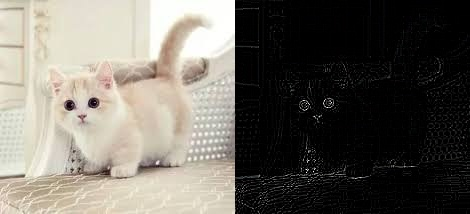

# image_filtering

>|filterl| | |  
>|---|---|---|
>|-1|0|-1|  
>|0|5|0|  
>|-1|0|-1|     
            

>|filter2| | |  
>|---|---|---|  
>|-3|0|21|  
>|3|-5|2|  
>|-1|0|-16|     

>|filter3| | |  
>|---|---|---|
>|-10|7|1|  
>|-3|2|-2|  
>|9|0|-5|     
            

